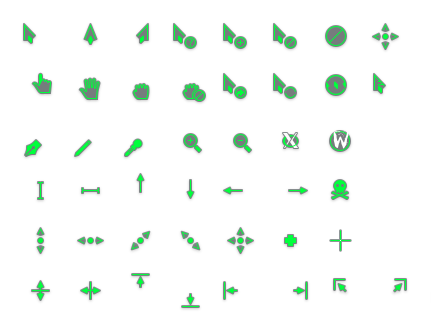

# breeze-hacked-cursor-theme (except green!)

Forked from [clayrisser](https://github.com/clayrisser/breeze-hacked-cursor-theme)

## Installation

```sh
make install
```


## Dependencies

* [Inkscape](https://inkscape.org)
* [xcursorgen](https://www.x.org/archive/X11R7.7/doc/man/man1/xcursorgen.1.xhtml)


## Screenshots




## License

[GPL 2.0 License](https://github.com/jamrizzi/breeze-hacked-cursor-theme/blob/master/LICENSE)


## Credits

* Ken Vermette <vermette@gmail.com> - Cursor Author
* Hugo Pereira Da Costa <hugo.pereira@free.fr> - Kstyle Developer
* Andrew Lake <jamboarder@gmail.com> - Kstyle Designer
* Uri Herrera <kaisergreymon99@gmail.com> - Breeze Icon Theme
* [Jam Risser](https://jam.jamrizzi.com) <jam@jamrizzi.com> - Contributor

